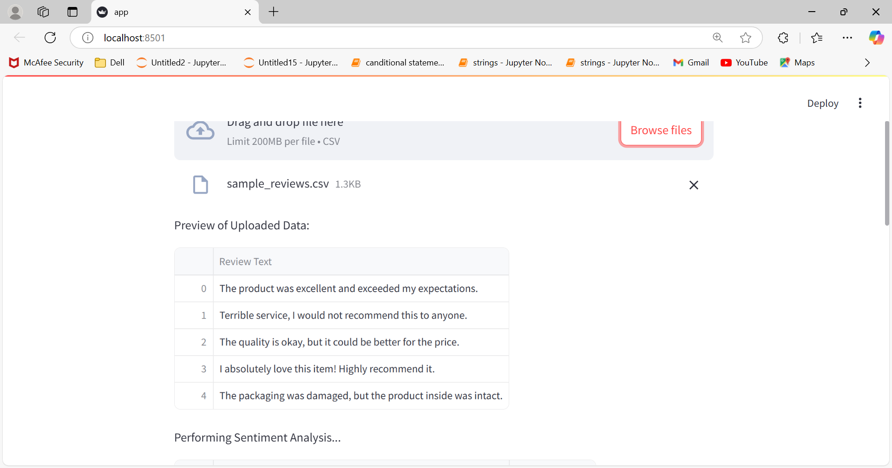

# **Sentiment Analysis Dashboard**

A Streamlit application that performs sentiment analysis on customer reviews. Users can upload CSV files containing reviews, and the app provides detailed sentiment analysis with visualizations like pie charts and word clouds.

---

## **Features**

- Upload CSV files with customer reviews.
- Analyze sentiments (`Positive`, `Neutral`, `Negative`) for each review using **TextBlob**.
- Interactive visualizations:
  - Pie chart showing sentiment distribution.
  - Word clouds for frequent positive and negative words.
- Intuitive user interface for non-technical users.

---

## **Demo Video**

[Watch the Demo Video](https://youtu.be/62bmg7iAsYA)

## **scren short**

 
 
.png>)
---

## **Usage**

1. Upload a CSV file containing a column named `Review Text`.
2. View sentiment analysis results in a table.
3. Explore visualizations for sentiment distribution and word frequency.

---

## **Technologies Used**

- **Programming Language**: Python
- **Libraries**: 
  - [Streamlit](https://streamlit.io/) for dashboard creation.
  - [TextBlob](https://textblob.readthedocs.io/) for sentiment analysis.
  - [pandas](https://pandas.pydata.org/) for data manipulation.
  - [matplotlib](https://matplotlib.org/) and [wordcloud](https://github.com/amueller/word_cloud) for visualizations.

---

## **Dataset**

- **Source**: 
- The dataset contains 500,000+ reviews, including `Review Text`, `Summary`, and `Score`.

---

## **License**

This project is licensed under the MIT License. See the `LICENSE` file for more details.

---
